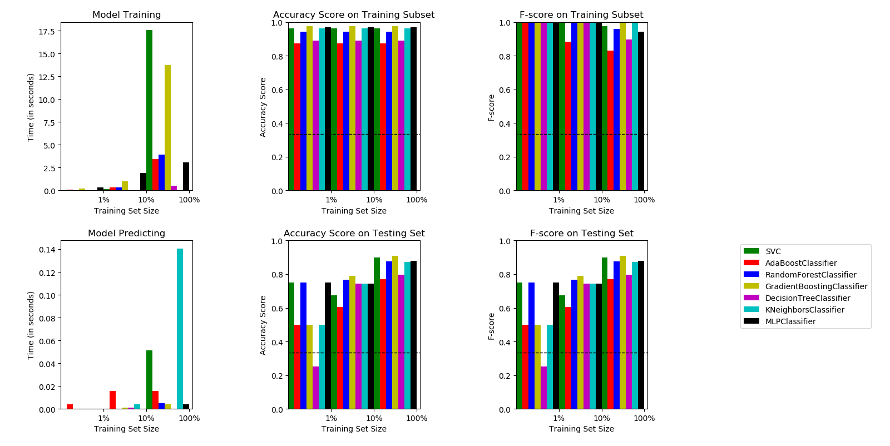

# Speech Emotion Recognition
## Introduction
- This repository handles building and training Speech Emotion Recognition System.
- The basic idea behind this tool is to build and train/test a suited machine learning ( as well as deep learning ) algorithm that could recognize and detects human emotions from speech.
- This is useful for many industry fields such as making product recommendations, affective computing, etc.
- Check this [tutorial](https://www.thepythoncode.com/article/building-a-speech-emotion-recognizer-using-sklearn) for more information.
## Requirements
- **Python 3.6+**
### Python Packages
- **tensorflow**
- **librosa==0.6.3**
- **numpy**
- **pandas**
- **soundfile==0.9.0**
- **wave**
- **scikit-learn==0.24.2**
- **tqdm==4.28.1**
- **matplotlib==2.2.3**
- **pyaudio==0.2.11**
- **[ffmpeg](https://ffmpeg.org/) (optional)**: used if you want to add more sample audio by converting to 16000Hz sample rate and mono channel which is provided in ``convert_wavs.py``

Install these libraries by the following command:
```
pip3 install -r requirements.txt
```

### Dataset
This repository used 4 datasets (including this repo's custom dataset) which are downloaded and formatted already in `data` folder:
- [**RAVDESS**](https://zenodo.org/record/1188976) : The **R**yson **A**udio-**V**isual **D**atabase of **E**motional **S**peech and **S**ong that contains 24 actors (12 male, 12 female), vocalizing two lexically-matched statements in a neutral North American accent.
- [**TESS**](https://tspace.library.utoronto.ca/handle/1807/24487) : **T**oronto **E**motional **S**peech **S**et that was modeled on the Northwestern University Auditory Test No. 6 (NU-6; Tillman & Carhart, 1966). A set of 200 target words were spoken in the carrier phrase "Say the word _____' by two actresses (aged 26 and 64 years).
- [**EMO-DB**](http://emodb.bilderbar.info/docu/) : As a part of the DFG funded research project SE462/3-1 in 1997 and 1999 we recorded a database of emotional utterances spoken by actors. The recordings took place in the anechoic chamber of the Technical University Berlin, department of Technical Acoustics. Director of the project was Prof. Dr. W. Sendlmeier, Technical University of Berlin, Institute of Speech and Communication, department of communication science. Members of the project were mainly Felix Burkhardt, Miriam Kienast, Astrid Paeschke and Benjamin Weiss.
- **Custom** : Some unbalanced noisy dataset that is located in `data/train-custom` for training and `data/test-custom` for testing in which you can add/remove recording samples easily by converting the raw audio to 16000 sample rate, mono channel (this is provided in `create_wavs.py` script in ``convert_audio(audio_path)`` method which requires [ffmpeg](https://ffmpeg.org/) to be installed and in *PATH*) and adding the emotion to the end of audio file name separated with '_' (e.g "20190616_125714_happy.wav" will be parsed automatically as happy)


### Emotions available
There are 9 emotions available: "neutral", "calm", "happy" "sad", "angry", "fear", "disgust", "ps" (pleasant surprise) and "boredom".
## Feature Extraction
Feature extraction is the main part of the speech emotion recognition system. It is basically accomplished by changing the speech waveform to a form of parametric representation at a relatively lesser data rate.

In this repository, we have used the most used features that are available in [librosa](https://github.com/librosa/librosa) library including:
- [MFCC](https://en.wikipedia.org/wiki/Mel-frequency_cepstrum)
- Chromagram 
- MEL Spectrogram Frequency (mel)
- Contrast
- Tonnetz (tonal centroid features)

## Grid Search
Grid search results are already provided in `grid` folder, but if you want to tune various grid search parameters in `parameters.py`, you can run the script `grid_search.py` by:
```
python grid_search.py
```
This may take several hours to complete execution, once it is finished, best estimators are stored and pickled in `grid` folder.

## Example 1: Using 3 Emotions
The way to build and train a model for classifying 3 emotions is as shown below:
```python
from emotion_recognition import EmotionRecognizer
from sklearn.svm import SVC
# init a model, let's use SVC
my_model = SVC()
# pass my model to EmotionRecognizer instance
# and balance the dataset
rec = EmotionRecognizer(model=my_model, emotions=['sad', 'neutral', 'happy'], balance=True, verbose=0)
# train the model
rec.train()
# check the test accuracy for that model
print("Test score:", rec.test_score())
# check the train accuracy for that model
print("Train score:", rec.train_score())
```
**Output:**
```
Test score: 0.8148148148148148
Train score: 1.0
```
### Determining the best model
In order to determine the best model, you can by:

```python
# loads the best estimators from `grid` folder that was searched by GridSearchCV in `grid_search.py`,
# and set the model to the best in terms of test score, and then train it
rec.determine_best_model()
# get the determined sklearn model name
print(rec.model.__class__.__name__, "is the best")
# get the test accuracy score for the best estimator
print("Test score:", rec.test_score())
```
**Output:**
```
MLPClassifier is the best
Test Score: 0.8958333333333334
```
### Predicting
Just pass an audio path to the `rec.predict()` method as shown below:
```python
# this is a neutral speech from emo-db from the testing set
print("Prediction:", rec.predict("data/emodb/wav/15a04Nc.wav"))
# this is a sad speech from TESS from the testing set
print("Prediction:", rec.predict("data/validation/Actor_25/25_01_01_01_back_sad.wav"))
```
**Output:**
```
Prediction: neutral
Prediction: sad
```
You can pass any audio file, if it's not in the appropriate format (16000Hz and mono channel), then it'll be automatically converted, make sure you have `ffmpeg` installed in your system and added to *PATH*.
## Example 2: Using RNNs for 5 Emotions
```python
from deep_emotion_recognition import DeepEmotionRecognizer
# initialize instance
# inherited from emotion_recognition.EmotionRecognizer
# default parameters (LSTM: 128x2, Dense:128x2)
deeprec = DeepEmotionRecognizer(emotions=['angry', 'sad', 'neutral', 'ps', 'happy'], n_rnn_layers=2, n_dense_layers=2, rnn_units=128, dense_units=128)
# train the model
deeprec.train()
# get the accuracy
print(deeprec.test_score())
# predict angry audio sample
prediction = deeprec.predict('data/validation/Actor_10/03-02-05-02-02-02-10_angry.wav')
print(f"Prediction: {prediction}")
```
**Output:**
```
0.7717948717948718
Prediction: angry
```
Predicting probabilities is also possible (for classification ofc):
```python
print(deeprec.predict_proba("data/emodb/wav/16a01Wb.wav"))
```
**Output:**
```
{'angry': 0.99878675, 'sad': 0.0009922335, 'neutral': 7.959707e-06, 'ps': 0.00021298956, 'happy': 8.3598025e-08}
```
### Confusion Matrix
```python
print(deeprec.confusion_matrix(percentage=True, labeled=True))
```
**Output:**
```
              predicted_angry  predicted_sad  predicted_neutral  predicted_ps  predicted_happy
true_angry          80.769226       7.692308           3.846154      5.128205         2.564103
true_sad            12.820514      73.076920           3.846154      6.410257         3.846154
true_neutral         1.282051       1.282051          79.487183      1.282051        16.666668
true_ps             10.256411       3.846154           1.282051     79.487183         5.128205
true_happy           5.128205       8.974360           7.692308      8.974360        69.230774
```
## Example 3: Not Passing any Model and Removing the Custom Dataset
Below code initializes `EmotionRecognizer` with 3 chosen emotions while removing Custom dataset, and setting `balance` to `False`:
```python
from emotion_recognition import EmotionRecognizer
# initialize instance, this will take a bit the first time executed
# as it'll extract the features and calls determine_best_model() automatically
# to load the best performing model on the picked dataset
rec = EmotionRecognizer(emotions=["angry", "neutral", "sad"], balance=False, verbose=1, custom_db=False)
# it will be trained, so no need to train this time
# get the accuracy on the test set
print(rec.confusion_matrix())
# predict angry audio sample
prediction = rec.predict('data/validation/Actor_10/03-02-05-02-02-02-10_angry.wav')
print(f"Prediction: {prediction}")
```
**Output:**
```
[+] Best model determined: RandomForestClassifier with 93.454% test accuracy

              predicted_angry  predicted_neutral  predicted_sad
true_angry          98.275864           1.149425       0.574713
true_neutral         0.917431          88.073395      11.009174
true_sad             6.250000           1.875000      91.875000

Prediction: angry
```
You can print the number of samples on each class:
```python
rec.get_samples_by_class()
```
**Output:**
```
         train  test  total
angry      910   174   1084
neutral    650   109    759
sad        862   160   1022
total     2422   443   2865
```
In this case, the dataset is only from TESS and RAVDESS, and not balanced, you can pass `True` to `balance` on the `EmotionRecognizer` instance to balance the data.
## Algorithms Used
This repository can be used to build machine learning classifiers as well as regressors for the case of 3 emotions {'sad': 0, 'neutral': 1, 'happy': 2} and the case of 5 emotions {'angry': 1, 'sad': 2, 'neutral': 3, 'ps': 4, 'happy': 5}
### Classifiers
- SVC
- RandomForestClassifier
- GradientBoostingClassifier
- KNeighborsClassifier
- MLPClassifier
- BaggingClassifier
- Recurrent Neural Networks (Keras)
### Regressors
- SVR
- RandomForestRegressor
- GradientBoostingRegressor
- KNeighborsRegressor
- MLPRegressor
- BaggingRegressor
- Recurrent Neural Networks (Keras)

### Testing
You can test your own voice by executing the following command:
```
python test.py
```
Wait until "Please talk" prompt is appeared, then you can start talking, and the model will automatically detects your emotion when you stop (talking).

You can change emotions to predict, as well as models, type ``--help`` for more information.
```
python test.py --help
```
**Output:**
```
usage: test.py [-h] [-e EMOTIONS] [-m MODEL]

Testing emotion recognition system using your voice, please consider changing
the model and/or parameters as you wish.

optional arguments:
  -h, --help            show this help message and exit
  -e EMOTIONS, --emotions EMOTIONS
                        Emotions to recognize separated by a comma ',',
                        available emotions are "neutral", "calm", "happy"
                        "sad", "angry", "fear", "disgust", "ps" (pleasant
                        surprise) and "boredom", default is
                        "sad,neutral,happy"
  -m MODEL, --model MODEL
                        The model to use, 8 models available are: "SVC","AdaBo
                        ostClassifier","RandomForestClassifier","GradientBoost
                        ingClassifier","DecisionTreeClassifier","KNeighborsCla
                        ssifier","MLPClassifier","BaggingClassifier", default
                        is "BaggingClassifier"

```

## Plotting Histograms
This will only work if grid search is performed.
```python
from emotion_recognition import plot_histograms
# plot histograms on different classifiers
plot_histograms(classifiers=True)
```
**Output:**


<p align="center">A Histogram shows different algorithms metric results on different data sizes as well as time consumed to train/predict.</p>